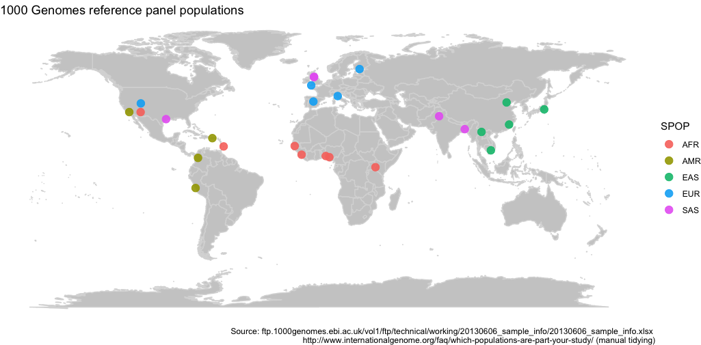

# Map 1000 Genomes populations

This repository provides the R-Code to map the 26 populations of the 1000 genomes project.

## Goal

Create a map as on the front page of http://www.internationalgenome.org/ in a reproducible manner. 

## Data
- The population counts and labels are from here: ftp.1000genomes.ebi.ac.uk/vol1/ftp/technical/working/20130606_sample_info/20130606_sample_info.xlsx
- The super population labels are from here: http://www.internationalgenome.org/faq/which-populations-are-part-your-study/ (pasted into a csv, then location was inferred)

## Result

Some deviation, see below. 

## Difficulty

There are many populations for which the current location is the same as the ancestry (to a certain extent of course), e.g. TSI (Toscani in Italy). But others, such as ITU (Indian Telugu from the UK) are living in the UK and have a language in common (not necessarily a geographical location). 
Hence I mapped the populations according to the current location, but coloured them according to ancestry. 
